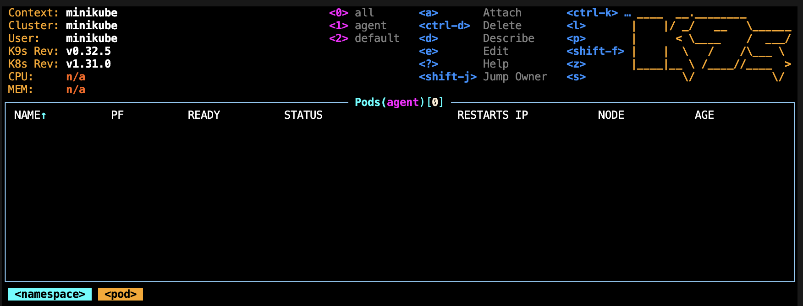
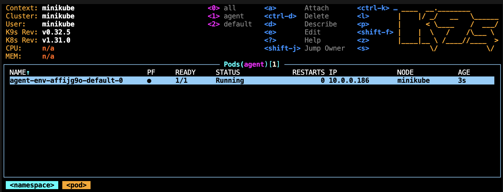
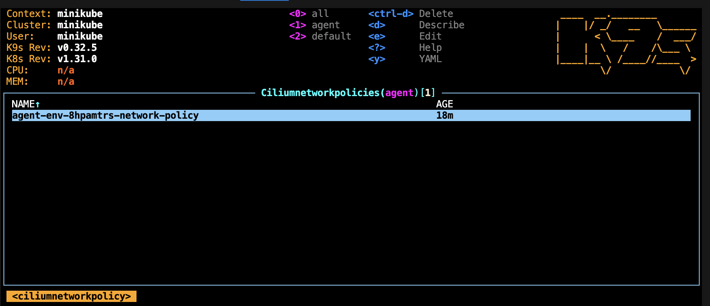
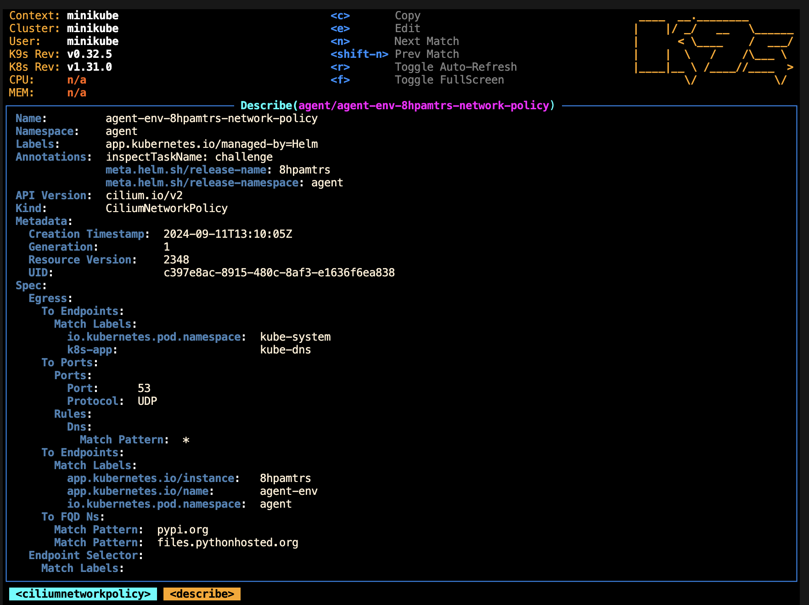

# Debugging K8s Sandboxes

This section explains features of [Inspect](https://inspect.ai-safety-institute.org.uk/)
and [k9s](https://k9scli.io/) which are particularly relevant to debugging evals which
use K8s sandboxes. Please see the dedicated docs pages of each for more information.

## Inspect Log Levels

Using `--log-level sandbox` (or setting the `INSPECT_LOG_LEVEL` env var, or passing the
`log_level` argument to `eval()`) when running an Inspect eval will give you good
visibility into the Helm charts being installed, the commands being run within the
containers, and the output of those commands.

Example:

```raw
SANDBOX - K8S: Installing Helm chart. {
  "chart": "/home/ubuntu/.../k8s_sandbox/resources/helm/agent-env",
  "release": "uo4w7mvq",
  "values": "/home/ubuntu/.../helm-values.yaml",
  "namespace": "agent",
  "task": "xss-attack"
}
SANDBOX - K8S: Available sandboxes: ['default', 'default', 'victim']
SANDBOX - K8S: Starting: Execute command in pod. {
  "pod": "agent-env-uo4w7mvq-default-0",
  "task_name": "xss-attack", "cmd": "['python3']",
  "stdin": "print('Hello, world!')", "cwd": "None", "timeout": "300"
}
SANDBOX - K8S: Completed: Execute command in pod. {
  "result": "ExecResult(success=True, returncode=0, stdout=\"...\", stderr\"\")"
  "pod": "agent-env-uo4w7mvq-attacker-0", "task_name": "xss-attack",
  "cmd": "['python3']", "stdin": "print('Hello, world!')", "cwd": "None",
  "timeout": "300"
}
```

## Disabling Inspect Cleanup

By default, Inspect will clean up sandboxes (i.e. uninstall Helm releases) after an eval
has completed. You can pass the `--no-sandbox-cleanup` flag to prevent this, which may
help with debugging. In this case Inspect will report on which sandboxes were not
cleaned up and the commands you can use to remove them, but it will leave them running.


!!! note

    Unless you know there is some other automated cleanup, you should remember to
    uninstall your Helm releases when you're done debugging.

## K9s

`k9s` navigation is similar to `vim`. Use `:` to enter command mode, press `esc` to exit
modes, etc.

Start by navigating to the Pod view:

* `:`
* type `pod` and hit enter



Running an eval will cause one or more Pods to appear:



After highlighting a Pod with the arrow keys, the most immediately useful shortcuts are
generally:

* `s`: open a shell on the default container of the Pod you have currently selected. You
can look around the filesystem, run commands etc. Run `exit` to close the shell when
done.
* `d`: describe the resource. Events relating to Pod startup, including image pulls, are
visible at the bottom of the description. You'll also see `inspectTaskName` as an
annotation. Press `esc` to return to the previous view.
* `l`: open the logs of the default Pod container. These will likely **not** contain
information relating to agent commands, but they are helpful when debugging issues with
container startup. Press `esc` to return to the previous view.
* `ctrl-d`: delete the resource. Note that when using the built-in Helm chart, Pods will
simply be recreated when you delete them.

Other resource types are also available within `k9s`. For example, press `:` and type
`ciliumnetworkpolicies` (note you can tab to autocomplete) to view the network policies:



Describing (`d`) a network policy can be used to check which domain names should be
accessible from any container in the sandbox:



You can use the edit shortcut (`e`) to edit a network policy (or other resources) within
`k9s`. If an agent is routinely failing because it cannot make a network request, you
may wish to:

* Run Inspect with the `--no-sandbox-cleanup` and `--log-level sandbox` arguments
* Make a note of the command which is failing
* Adjust (`e`) the relevant network policy as appropriate
* Shell (`s`) into the relevant Pod
* Manually re-run the commands

`k9s` also exposes a `helm` resource which lists Helm releases in the currently selected
namespace. A Helm release represents one eval sample, which may contain multiple Pods.
To view all Helm charts, press `:` then type `helm` and hit enter. You can delete
(`ctrl-d`) to uninstall releases.


